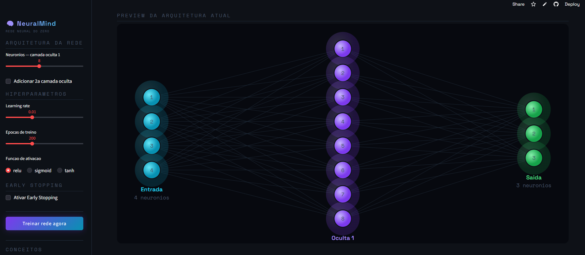

# 🧠 NeuralMind — Rede Neural do Zero

Aplicação educacional interativa que implementa uma **Rede Neural Artificial completa usando apenas NumPy** — sem PyTorch, TensorFlow ou Keras. Classifica flores do dataset Iris e expõe cada etapa do aprendizado de forma visual e explicada.

> Projeto da série **ML Educativo** — aprender Machine Learning construindo do zero.

---

## Interface



> A imagem mostra a tela inicial do NeuralMind: à esquerda, a sidebar com todos os controles de arquitetura e hiperparâmetros; ao centro e à direita, o SVG animado da rede — neurônios coloridos (azul = entrada, roxo = oculta, verde = saída) com conexões cujas espessuras são proporcionais aos pesos.

---

## O que você aprende com este projeto

Esta aplicação foi desenhada para tornar **concretos e visíveis** os conceitos que costumam parecer abstratos em livros e cursos:

### 1. Forward Pass — Como a informação flui
A entrada (4 features do Iris) percorre cada camada da rede multiplicando pelos pesos e somando os bias, passando por uma função de ativação. No app, cada neurônio **brilha com intensidade proporcional à sua ativação**, tornando visível o fluxo de informação.

```
z = W · x + b       # transformação linear
a = f(z)            # ativação não-linear (ReLU / Sigmoid / Tanh)
P(k) = exp(z_k) / Σ exp(z_j)   # Softmax na saída → probabilidades
```

### 2. Backpropagation — Como o erro volta
Após o forward pass, calculamos o erro (loss). O backprop usa a **regra da cadeia** para calcular o quanto cada peso contribuiu para o erro, propagando o gradiente camada a camada de trás para frente.

```
δ_saída = y_pred - y_true           # gradiente da saída (Softmax + Cross-Entropy)
dL/dW   = a_prev.T @ δ / n         # gradiente dos pesos
δ_prev  = (δ @ W.T) * f'(z)        # propaga para a camada anterior
```

### 3. Gradient Descent — Como os pesos se ajustam
Com os gradientes calculados, cada peso é atualizado na direção que reduz o erro. O **learning rate** controla o tamanho do passo — muito alto oscila, muito baixo converge devagar.

```
W = W - lr × dL/dW
b = b - lr × dL/db
```

### 4. Loss Landscape — A superfície do erro
O app gera uma superfície 3D ao redor dos pesos finais, projetando dois eixos aleatórios no espaço de parâmetros. O vale mais fundo é o mínimo encontrado pelo treinamento — o ponto verde marca exatamente onde os pesos estão.

### 5. Early Stopping — Evitando overfitting
Quando a `val_loss` para de diminuir por N épocas consecutivas, o treino é interrompido automaticamente. Isso evita que a rede "decore" os dados de treino e perca generalização.

---

## Funcionalidades

| Funcionalidade | Descrição |
|---|---|
| **Arquitetura configurável** | 1 ou 2 camadas ocultas, número de neurônios por camada |
| **3 funções de ativação** | ReLU, Sigmoid, Tanh — com comparativo de propriedades |
| **SVG animado da rede** | Espessura das conexões = magnitude do peso; brilho = ativação |
| **Curvas de Loss e Acurácia** | Treino vs. validação, Plotly interativo |
| **Log de épocas** | Barra de progresso por época com Perda, Acurácia e Val |
| **Loss Landscape 3D** | Superfície de perda com ponto do mínimo destacado |
| **Navegação por snapshots** | Veja os pesos em qualquer época do treinamento |
| **Mapas de calor dos pesos** | Magnitude e sinal de cada conexão por camada |
| **Matriz de Confusão** | Com Precisão, Recall e F1-Score por classe |
| **Fronteira de Decisão** | Projeção 2D do que a rede aprendeu |
| **Forward Pass passo a passo** | Insira valores manualmente e veja as ativações camada a camada |
| **Early Stopping** | Para o treino automaticamente quando val_loss estagna |
| **Tooltip de Learning Rate** | Aviso automático se a taxa está muito alta ou muito baixa |
| **Exportar modelo** | Baixa os pesos treinados em `.npz` para uso externo |
| **Código exposto** | Implementação NumPy comentada na aba "Como Funciona" |

---

## Como executar

```bash
git clone https://github.com/Victormartinsilva/REDE_NEURAL.git
cd REDE_NEURAL
pip install -r requirements.txt
streamlit run app.py
```

Acesse em `http://localhost:8501` após rodar o comando.

### Ou acesse diretamente online

**[🚀 neuralmind.streamlit.app](https://redeneural-qkgchsrmgfoaajcapncbin.streamlit.app/)**

---

## Implementação — NumPy puro

A rede foi construída **do zero**, sem nenhum framework de deep learning. O núcleo completo em ~60 linhas:

```python
import numpy as np

class NeuralNetwork:
    def __init__(self, layer_sizes, lr=0.01):
        self.weights = []
        self.biases  = []
        for i in range(len(layer_sizes) - 1):
            W = np.random.randn(layer_sizes[i], layer_sizes[i+1]) * np.sqrt(2/layer_sizes[i])
            b = np.zeros((1, layer_sizes[i+1]))
            self.weights.append(W)
            self.biases.append(b)
        self.lr = lr

    def relu(self, z):
        return np.maximum(0, z)

    def softmax(self, z):
        e = np.exp(z - z.max(axis=1, keepdims=True))
        return e / e.sum(axis=1, keepdims=True)

    def forward(self, X):
        a = X
        self._cache = [X]
        for i, (W, b) in enumerate(zip(self.weights, self.biases)):
            z = a @ W + b
            a = self.relu(z) if i < len(self.weights)-1 else self.softmax(z)
            self._cache.append(a)
        return a

    def backward(self, y_true):
        n     = y_true.shape[0]
        delta = self._cache[-1] - y_true
        for i in reversed(range(len(self.weights))):
            dW = self._cache[i].T @ delta / n
            db = delta.mean(axis=0, keepdims=True)
            if i > 0:
                delta = (delta @ self.weights[i].T) * (self._cache[i] > 0)
            self.weights[i] -= self.lr * dW
            self.biases[i]  -= self.lr * db
```

---

## Dataset — Iris

| Feature | Descrição |
|---|---|
| Comprimento da Sépala | em centímetros |
| Largura da Sépala | em centímetros |
| Comprimento da Pétala | em centímetros |
| Largura da Pétala | em centímetros |

- **150 amostras** — 50 por classe
- **3 classes:** Setosa, Versicolor, Virginica
- **Split:** 80% treino / 20% validação (estratificado)
- **Pré-processamento:** StandardScaler (média 0, desvio 1)

---

## Stack

| Biblioteca | Uso |
|---|---|
| **NumPy** | Toda a rede neural (pesos, forward, backprop, gradientes) |
| **Streamlit** | Interface web interativa |
| **Plotly** | Gráficos 3D e 2D interativos |
| **scikit-learn** | Apenas carregamento do dataset e train/test split |
| **Pandas** | Tabelas de métricas e estatísticas |

---

## Série ML Educativo

| # | Projeto | Conceito principal |
|---|---|---|
| 1 | 🎮 Jogo da Velha | Q-Learning |
| 2 | 🌿 Diagnóstico de Plantas | Árvore de Decisão |
| 3 | 🚜 TractorMind | Regras de Associação (Apriori) |
| 4 | 🧠 **NeuralMind** | **Rede Neural do Zero** |

---

**Autor:** Victor Martin Silva
**Licença:** MIT
